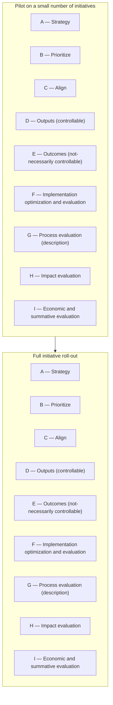

# DoView Tool G16 — Full Initiative Roll-Out Versus Piloting Evaluation Explainer

> **Pair:** [Question](g16question.md) · Tool (this page)

Where the same initiative is rolled out at many different sites, there are two options for conceptualizing impact evaluation. The first is to try to evaluate the impact of the entire full roll-out on outcomes. But if this is not appropriate, feasible, or affordable, then another option is to do a comprehensive evaluation, including impact evaluation of an initial piloting phase, and then use a simpler form of evaluation on each of the individual initiatives when they are finally rolled out. This is shown below using the DoView Planning Framework (D1) components. This is the approach used in many areas such as medicine where randomized controlled trials are used to show that an intervention works, but when the intervention is rolled out and used in the field, there is just monitoring of controllable indicators rather than any attempt at impact evaluation on the full roll-out. In terms of impact evaluation designs the overall approach can be seen as an Intervention logic Model (Theory-Based) Design (see G9). The gray boxes below show which elements are being used at the piloting versus the full roll-out phase.

## Diagram

In the piloting phase, all of the DoView Planning Framework components (A–I) are typically used to comprehensively evaluate the initiative. In the full roll-out phase, a simpler approach is taken — typically focusing on monitoring outputs and controllable indicators (D) rather than repeating impact evaluation (H) on every individual initiative.

---

*Source: DOVIEW PLANNING AND PRACTICAL OUTCOMES THEORY HANDBOOK (2025). DoView Planning.Org. Copyright Dr Paul W Duignan.*
