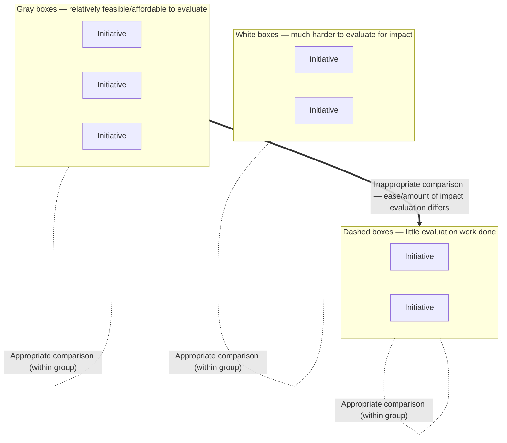

# DoView Tool G17 — When 'What Works' Comparisons Between Initiatives Are Appropriate Checklist

> **Pair:** [Question](g17question.md) · Tool (this page)

In an increasingly outcomes orientated world, one approach is for purchasers/funders and control agencies to fund only 'What Works'. The idea is that only intiatives that have robust impact evaluation evidence merit being funded in comparison to other initiatives.

You can use this tool to decide when it is sensible to make 'What Works' comparisons between initiatives. It is relatively feasible and affordable to evaluate the impact of the gray boxes below. But the white boxes are much harder to evaluate for impact, and there has been little evaluation work done on the dashed boxes.

## Diagram

Comparisons within each group (gray with gray, white with white, dashed with dashed) are appropriate. Comparing across groups is inappropriate because the ease of impact evaluation or amount of impact evaluation undertaken differs.

## Checklist

1. Do the initiatives being compared have the same ease of evaluation? IF NO, DON'T DO A SIMPLISTIC IMPACT EVALUATION 'WHAT WORKS' COMPARISON.

2. Has the same amount of impact evaluation been done on each of the initiatives being compared? IF NO, DON'T DO A SIMPLISTIC 'WHAT WORKS' COMPARISON.

3. Do the initiatives being compared have different reach? USE COST-EFFECTIVENESS ANALYSIS TO WORK OUT WHICH IS THE BEST INITIATIVE WHEN YOU CONSIDER REACH.

---

*Source: DOVIEW PLANNING AND PRACTICAL OUTCOMES THEORY HANDBOOK (2025). DoView Planning.Org. Copyright Dr Paul W Duignan.*
