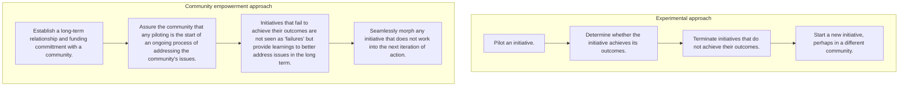

# DoView Tool G21 — How to Protect Morale in Community Programs Checklist

> **Pair:** [Question](g21question.md) · Tool (this page)

In an outcomes-focused world, experimenting with interventions seems like a sound idea. However, such an approach needs to be implemented carefullly when working on community empowerment and mobilization in disempowered communities with low social morale.

## Diagram

## Checklist

1. Is the community being worked with is one in which is disempowered? IF YES, THEN MORALE MAY BE AN ISSUE.

2. Does the community have a history of resources being withdrawn? IF YES, THEN MORALE MAY BE AN ISSUE.

3. Is it possible to have a long-term relationship with the community? IF NO, THEN MORALE MAY BE AN ISSUE.

4. Can the initiative be based in an ongoing institution in the community which will have a life beyond the initiative? IF NO, THEN MORALE MAY BE A ISSUE.

5. Can the lessons learnt from the initiative be transferred into a new initiative? IF NO, THEN MORALE MAY BE AN ISSUE.

---

*Source: DOVIEW PLANNING AND PRACTICAL OUTCOMES THEORY HANDBOOK (2025). DoView Planning.Org. Copyright Dr Paul W Duignan.*
