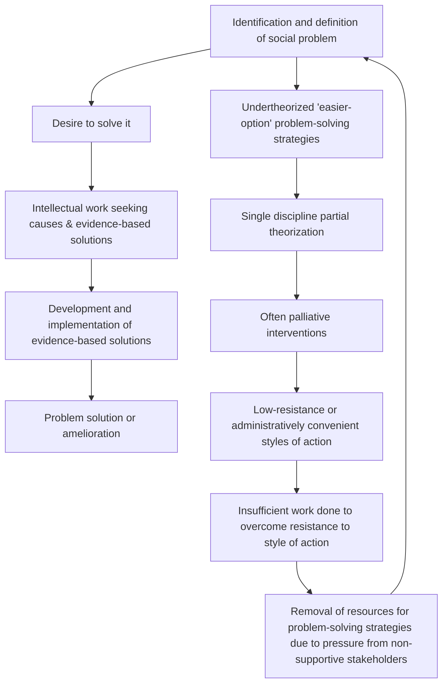

# DoView Tool G22 — Social Problem Solving Cycle

> **Pair:** [Question](g22question.md) · Tool (this page)

## Diagram

The diagram shows two pathways from the identification of a social problem:

- **Encouragement from supportive stakeholders** (right side): a desire to solve the problem leads to intellectual work seeking causes and evidence-based solutions, which leads to development and implementation of those solutions, and ultimately to problem solution or amelioration.
- **Resistance from currently non-supportive stakeholders** (left side): undertheorized 'easier-option' problem-solving strategies, single-discipline partial theorization, often palliative interventions, and low-resistance or administratively convenient styles of action lead to insufficient work being done to overcome resistance, removal of resources, and the cycle begins again.

---

*Source (diagram): Duignan, P. (1997) Evaluating Health Promotion: The Strategic Evaluation Framework. University of Waikato Doctorate, p. 249.*

*Source: DOVIEW PLANNING AND PRACTICAL OUTCOMES THEORY HANDBOOK (2025). DoView Planning.Org. Copyright Dr Paul W Duignan.*
