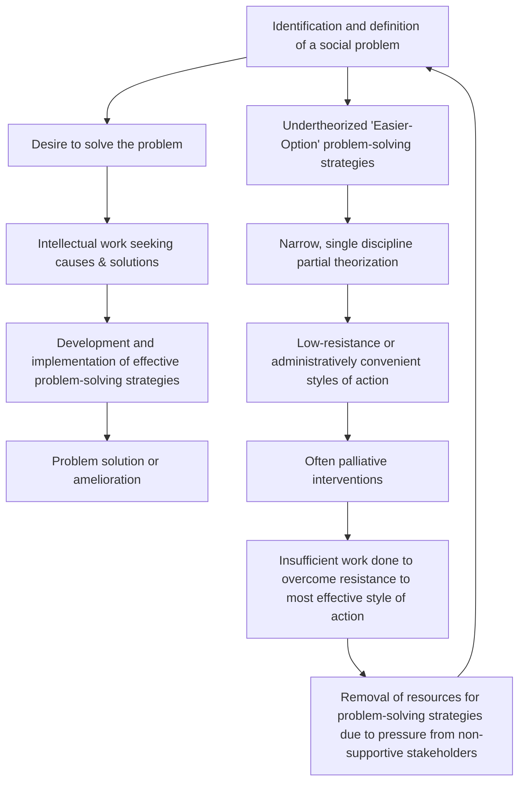

# DoView Tool G24 — Priority Types of Evaluation at Each Point in the Social Problem Solving Cycle

> **Pair:** [Question](g24question.md) · Tool (this page)

## Diagram

## Priority evaluation questions at each point

**Identification and definition of a social problem**

- Developmental evaluation: 'What exactly is the problem here?'
- Process evaluation: 'How was the problem defined in this initiative?'

**Desire to solve the problem / Intellectual work seeking causes & solutions**

- Developmental and formative evaluation: 'What evidence-based and peer and stakeholder review input can we get on the initiative's DoView strategy/outcomes diagram to ensure it's the most likely to be successful?'
- Formative evaluation: 'What are the key priorities that should be focused on in this initiative?'

**Development and implementation of effective problem-solving strategies**

- Outcome evaluation: 'Is the current mix of strategies working?'
- Process evaluation: 'What were the factors that protected the initiative from unjustified funding cuts?'
- Outcome evaluation: 'Are strategies despite being resisted by some stakeholders are actually working?'
- Process evaluation: 'What do supportive stakeholders think of the initiative?'

**Undertheorized 'Easier-Option' problem-solving strategies / Narrow, single discipline partial theorization**

- Process evaluation: 'What determined the selection of strategies used?'

**Low-resistance or administratively convenient styles of action / Often palliative interventions**

- Process evaluation: 'What were the dynamics of ending up with largely palliative solutions?'
- Outcome evaluation: 'Do these partial / palliative strategies work?'

**Insufficient work done to overcome resistance to most effective style of action**

- Process evaluation: 'What do currently non-supportive stakeholders think of the initiative?'
- Formative evaluation: 'How can currently non-supportive stakeholders concerns be addressed?'

**Removal of resources for problem-solving strategies due to pressure from non-supportive stakeholders**

- Process evaluation: 'Why was the initiative's funding cut?'

---

*Source: DOVIEW PLANNING AND PRACTICAL OUTCOMES THEORY HANDBOOK (2025). DoView Planning.Org. Copyright Dr Paul W Duignan.*
