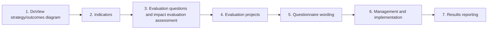

# DoView Tool G25 — DoView Monitoring and Evaluation (M&E) Plan

> **Pair:** [Question](g25question.md) · Tool (this page)

The typical sections included in a DoView M&E Plan are shown below. An example of a DoView M&E Plan is available at DoViewPlanning.Org.

## Diagram

## Sections

**Introduction: The Project** — Describes the facilitator role, region and purpose, then points to the strategy diagram as the project "road map".

**Introduction: What's a strategy diagram?** — Explains the DoView visual logic model and its symbols (@ = controllable indicator).

**Section 1: DoView strategy/outcomes diagram** — Shows the complete pathway of how project activities lead to biodiversity outcomes.

**Section 2: Indicators** — Maps draft indicators onto the diagram and shows which ones are directly attributable to the project.

**Section 3: Evaluation questions & impact evaluation assessment** — Shows evaluation questions mapped onto the DoView diagram, the type of evaluation they are, and provides the Impact Evaluation Feasibility Check analysis of the seven possible impact evaluation design types.

**Section 4: Evaluation projects** — Lists the evaluation projects and which evaluation questions they answer.

**Section 5: Questionnaire wording** — Discusses the interview and survey questions that will be used in the evaluation.

**Section 6: Evaluation management** — Outlines governance, contractor roles and the ongoing use of the DoView strategy/outcomes diagram within the evaluation.

**Section 7: Results reporting** — Proposes traffic-lighting the strategy diagram to highlight achieved boxes and problem areas in the final report.

---

*Source: DOVIEW PLANNING AND PRACTICAL OUTCOMES THEORY HANDBOOK (2025). DoView Planning.Org. Copyright Dr Paul W Duignan.*
