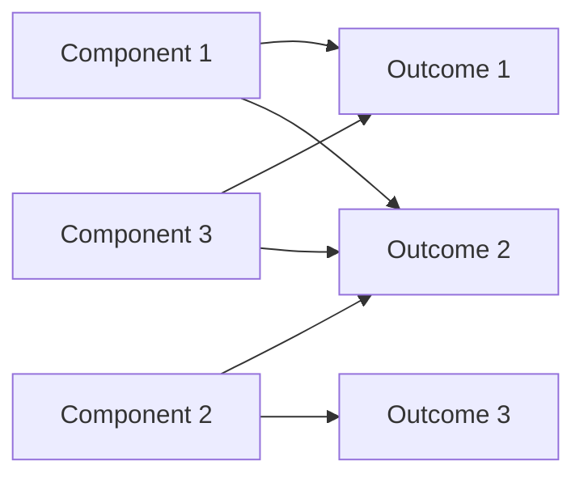
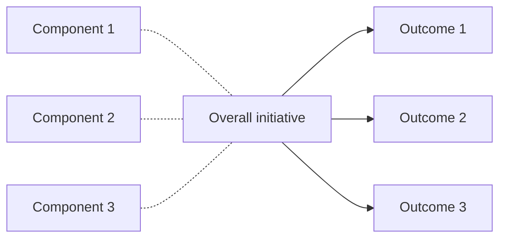

# DoView Tool G2a — Evaluating Individual Components or Streams Within an Initiative or Program

> **Pair:** [Question](g2aquestion.md) · Tool (this page)

Initiatives or programs often consist of several components or streams. While traditional evaluation usually focuses on an overall initiative, the Strategic Evaluation Approach (G2) also encourages focusing on the impact of individual components within an initiative. There are various reasons for this, but one is that the effectiveness of a strong component can be diluted by an ineffective one. Evaluating components separately is an aspirational goal but comes with complexities. There may be synergy between components, and some, while not highly effective on their own, may be necessary to gain community or stakeholder support for more effective elements.

Regardless, when constructing a DoView strategy/outcomes diagram, it is useful, where possible, to show how individual components are believed to influence higher-level boxes, rather than masking this logic by mapping only at the overall initiative level. This approach encourages seeing initiatives as composed of distinct parts. In 'A' below, the individual components of an initiative have been mapped. In contrast, the details of this are hidden if one only maps at the level of the overall initiative, as shown in 'B'.

## Diagram

### A — Individual components mapped to outcomes

### B — Mapping only at the overall initiative level

In **A**, the individual components of an initiative have been mapped to the outcomes they are believed to influence. In **B**, the details of this are hidden because mapping is only at the level of the overall initiative.

---

*Source: DOVIEW PLANNING AND PRACTICAL OUTCOMES THEORY HANDBOOK (2025). DoView Planning.Org. Copyright Dr Paul W Duignan.*
