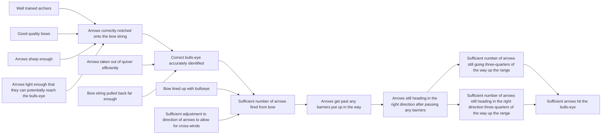

# DoView Tool G7 — Mapping a Set of Evaluation Questions Onto a Strategy/Outcomes Diagram

> **Pair:** [Question](g7question.md) · Tool (this page)

Below evaluation questions are shown on an illustrative 'Archery Initiative' DoView strategy/outcomes diagram (B4). Use this approach to identify duplicate evaluation questions and find the level at which any evaluation question is struck. Then use the Generic Evaluation Questions List (G4) to check if it is a comprehensive set of questions.

## Diagram

### Evaluation questions mapped to the diagram

| ID | Type | Question | Mapped to |
|---|---|---|---|
| 01 | IMPLEMENTATION EVALUATION | Can lighter arrows be sourced from another supplier? | "Arrows light enough that they can potentially reach the bulls-eye" |
| 02 | IMPLEMENTATION EVALUATION | Can the archers be trained to better allow for cross-winds? | "Sufficient adjustment to direction of arrows to allow for cross-winds" |
| 04 (process) | PROCESS EVALUATION | What management practices did the archers find supportive? | Cross-cutting (process / context) |
| 04 | IMPACT EVALUATION | Did the Archery Agency lead to more arrows hitting the bulls-eye? | "Sufficient arrows hit the bulls-eye" |
| 04a | IMPACT EVALUATION (duplicate of Q 04) | Did the Archery Agency achieve its outcome? | "Sufficient arrows hit the bulls-eye" |

The flow on the diagram runs left to right from IMPLEMENTATION EVALUATION through PROCESS EVALUATION to IMPACT EVALUATION. Implementation evaluation questions sit to the left of the diagram; impact evaluation questions sit to the right.

---

*Source: DOVIEW PLANNING AND PRACTICAL OUTCOMES THEORY HANDBOOK (2025). DoView Planning.Org. Copyright Dr Paul W Duignan.*
