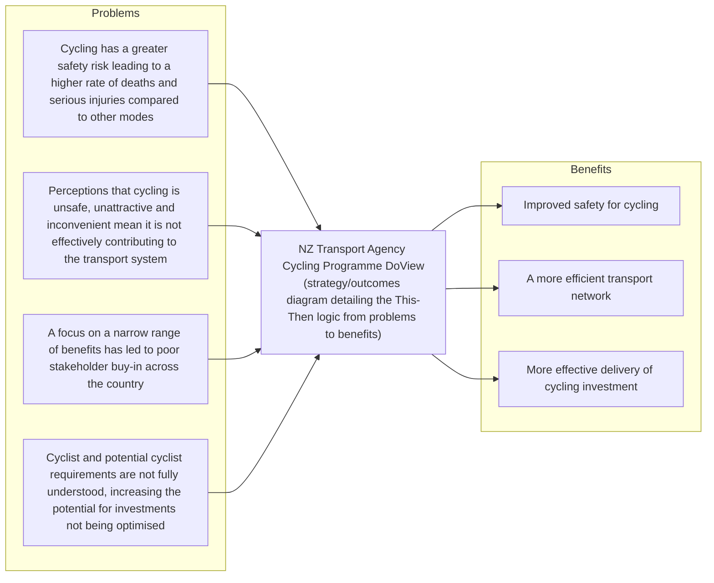

# DoView Tool H5 — Complementing an Investment Logic Map (ILM) With a DoView Strategy/Outcome Explainer

> **Pair:** [Question](h05question.md) · Tool (this page)

Investment Logic Mapping (ILM) provides a structure for framing what an initiative is aiming to achieve: moving from problems to benefits, to strategic responses, and finally to preferred solutions. In some instances, purchasers/funders require that those who are applying for funding set out what their initiative is trying to do by using an Investment Logic Map.

Any Investment Logic Map can be greatly enhanced by combining it with a DoView strategy/outcomes diagram. The DoView diagram adds depth and detail to the ILM by mapping out the specific 'This-Then' logic that connects problems to benefits. The fact that a DoView can have as many drill-down subpages as necessary means it can fully articulate what is being planned. In addition, if you use DoView Planning for implementing an initiative that has been funded, then this will help ensure tight alignment between what was proposed in the Investment Logic Map and what actually happens on the ground when the initiative is implemented.

Below can be seen how a DoView spells out in detail how an initiative will mean that one can move from 'problems' to 'benefits'. The DoView allows you to detail the strategic responses and solutions columns of the ILM in a way which can then immediately be used to drive the implementation of the initiative for which the ILM has been built.

## Diagram

A DoView used to enhance an ILM (illustrated example: NZ Transport Agency Cycling Programme).

---

*Source: DOVIEW PLANNING AND PRACTICAL OUTCOMES THEORY HANDBOOK (2025). DoView Planning.Org. Copyright Dr Paul W Duignan.*
