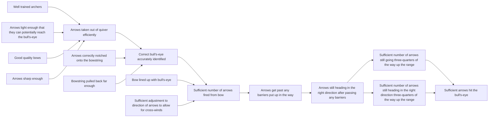

# DoView Tool H1 — Reporting Indicator and Evaluation Results Back Against a DoView Strategy Diagram

> **Pair:** [Question](h1question.md) · Tool (this page)

This tool shows an Archery Initiative DoView strategy/outcomes diagram with indicator results (numbered 001–009) and evaluation findings (numbered 01–04) reported directly back against the relevant steps in the diagram.

## Diagram

### Indicator results reported against steps

| Indicator | Step | Result |
|---|---|---|
| 001 Percentage archers with Archery Degree | Well trained archers | 20% |
| 002 Average time to remove an arrow from quiver | Arrows taken out of quiver efficiently | 1 sec |
| 003 Average distance bowstring pulled back | Bowstring pulled back far enough | 40 cm |
| 004 Percentage of archers accurately identify bull's-eye | Correct bull's-eye accurately identified | 75% |
| 005 Number of arrows fired per hour | Sufficient number of arrows fired from bow | 85 |
| 006 Percent arrows get past barriers | Arrows get past barriers | 63% |
| 007 Percent arrows still heading in the right direction after passing any barriers | Arrows still heading right after barriers | 52% |
| 008 Percent arrows still going three-quarters up the range | Sufficient number three-quarters up | 34% |
| 009 Number of arrows hitting the bulls-eye per hour | Sufficient arrows hit the bull's-eye | 28 |

### Evaluation findings reported against steps

| Eval Q | Step | Finding |
|---|---|---|
| 01 Can lighter arrows be sourced from another supplier? | Arrows light enough | Alternative supplier sourced |
| 02 What are the ways arrows can be taken out of the quiver? | Arrows taken out of quiver efficiently | Three techniques identified and taught to archers |
| 03 Are there any ways that the number of arrows fired can be increased? | Sufficient number of arrows fired from bow | Additional staff employed to feed arrows to archers |
| 04 Did the program increase the number of arrows hitting the bull's-eye? | Sufficient arrows hit the bull's-eye | Experimental impact evaluation design proved it did. The effect size was a 30% increase. |

---

*Source: DOVIEW PLANNING AND PRACTICAL OUTCOMES THEORY HANDBOOK (2025). DoView Planning.Org. Copyright Dr Paul W Duignan.*
