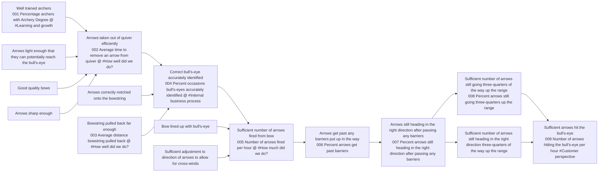

# DoView Tool H4 — Deriving Results-Based Accountability (RBA) Format From a DoView Strategy/Outcomes Diagram Explainer

> **Pair:** [Question](h4question.md) · Tool (this page)

Indicators can be located from a DoView strategy/outcomes diagram and then tagged with the type of Results Based Accountability (RBA) indicator they are (in B below). Then they can simply be rearranged under the Results Based Accountability indicator headings to provide an RBA report (in A below). This example uses the 'Archery Initiative' example (B4).

## Diagram

### A — Indicators rearranged under RBA headings

| RBA heading | Indicators |
|---|---|
| How much did we do? | 005 Number of arrows fired per hour @ #How much did we do? |
| How well did we do? | 002 Average time to remove an arrow from quiver @ #How well did we do?; 006 Cost for firing each arrow @ #How well did we do?; 003 Average distance bowstring pulled back @ #How well did we do? |
| Is anyone better off? | 009 Number of arrows hitting the bull's-eye per hour #Is anyone better off?; 011 Money saved by arrows hitting the target #Is anyone better off? |

\* @ = Controllable indicators

### B — Indicators tagged on the DoView strategy/outcomes diagram

---

*Source: DOVIEW PLANNING AND PRACTICAL OUTCOMES THEORY HANDBOOK (2025). DoView Planning.Org. Copyright Dr Paul W Duignan.*
