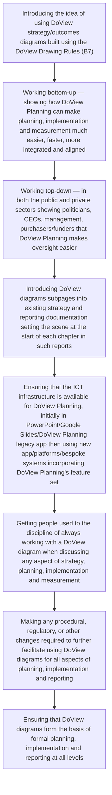

# DoView Tool I1 — Steps in Introducing DoView Strategy/Outcomes Diagrams and DoView Planning Into an Organization, Initiative or Sector

> **Pair:** [Question](i1question.md) · Tool (this page)

Below are the steps you need to take when introducing DoView strategy/outcomes diagrams and DoView Planning. These show how DoView diagrams can progressively be adopted as a central tool in planning and implementation. The idea is for an organization or initiative's DoView to become the shared thinking tool (artefact) for all planning, implementation and measurement discussions. Having a shared thinking tool for planning is analogous to military planners using a map when discussing strategy, or when those discussing a building project talk about their ideas against a detailed plan of the building.

Steps in progressive implementation of DoView strategy/outcomes diagrams and DoView Planning.

## Diagram

---

*Source: DOVIEW PLANNING AND PRACTICAL OUTCOMES THEORY HANDBOOK (2025). DoView Planning.Org. Copyright Dr Paul W Duignan.*
