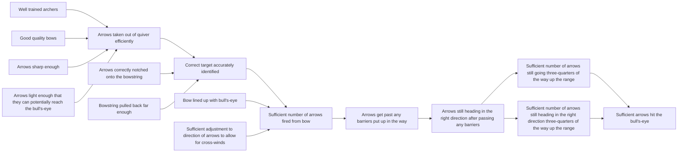

# DoView Tool I2 — How To Put a DoView Strategy/Outcomes Diagram into Existing Planning and Reporting Documents

> **Pair:** [Question](i2question.md) · Tool (this page)

The format of government planning and reporting documents is determined by legislative requirements and conventions about how they should be structured. An easy way to start using DoView strategy/outcomes diagrams is to put the relevant subpage from the agency or initiative's DoView diagram at the top of each chapter in reports, while the rest of the document is in the required format. The overview of an agency or initiative's DoView diagram can go in the introductory chapter, and each chapter about the agency or initiative's work can start with the relevant drill-down subpage. In some cases this has already been done in official government documentation where agencies have been using DoView Planning. Below shows the start of the introductory chapter of an 'Archery Initiative Plan' (B4).

## Diagram

### 1. Introduction to the Archery Initiative Plan

*The overview DoView strategy/outcomes diagram above shows the Archery Initiative's outcome: 'To ensure that sufficient arrows hit the bull's-eye'. The steps that we are pursuing to achieve this in our work are shown in the boxes in the diagram to the left of the outcome.*

*Our performance indicators are as follows . . .*

*The priorities are as follows . . .*

---

*Source: DOVIEW PLANNING AND PRACTICAL OUTCOMES THEORY HANDBOOK (2025). DoView Planning.Org. Copyright Dr Paul W Duignan.*
