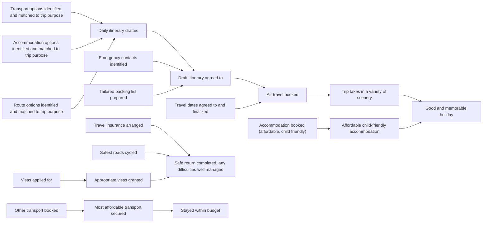

# DoView Tool J4 — Using DoView Prompts as a Complement to Everyday Language Prompts for AI Systems and Agents

> **Pair:** [Question](j04question.md) · Tool (this page)

DoView strategy/outcomes diagrams are used in organizational and initiative planning to check what an organization is planning to do and oversee and manage how it takes action in the world. Exactly the same approach should be explored to check how AI agents are interpreting users' everyday language prompts and overseeing and managing them as they act in the world. 'A' below shows a mockup of an AI-generated DoView feeding back to a user what an AI agent thinks a user is asking with their prompt about planning a cycling trip overseas. 'B' shows a DoView progress report from the AI Agent of what it has done and questions it wants the user to answer for it to proceed.

## Diagram

### A — DoView showing what the AI agent plans to do

### B — Portion of DoView showing what the AI agent has done and questions for user

| Box | Status | Note from AI agent |
|---|---|---|
| Transport options identified and matched to trip purpose | Done | — |
| Accommodation options identified and matched to trip purpose | Done | — |
| Route options identified and matched to trip purpose | Done | — |
| Daily itinerary drafted | Done | — |
| Emergency contacts identified | Done | — |
| Tailored packing list prepared | Done | — |
| Draft itinerary agreed to | Done | — |
| Travel dates agreed to and finalized | Question | "Proving difficult to get flights on first day, could you leave a day later?" |
| Air travel booked | Pending | "Will book once you confirm dates." |
| Other transport booked | Done | — |
| Accommodation booked (affordable, child friendly) | Question | "Accommodation on third day more expensive but cheaper accommodation not so suitable for children. OK to book?" |
| Travel insurance arranged | Done | — |
| Visas applied for | Done | — |

---

*Source: Outcomes Theory & DoView Planning. DoViewPlanning.Org Copyright Dr Paul Duignan 2025. DOVIEW PLANNING AND PRACTICAL OUTCOMES THEORY HANDBOOK (2025).*
