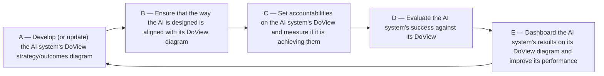

# DoView Tool J2 — Five Step DoView AI Management

> **Pair:** [Question](j2question.md) · Tool (this page)

DoView Planning is based on outcomes theory, a generic theory of taking any type of action in the real world. It can be applied both to human organizations and initiatives, as well as to AI agents. AI agents are AI systems that are allowed to take action in the world. We are now at a moment in history when AI agents will undertake more and more action in the world—initially under direct human control, but progressively with greater autonomy. From the point of view of outcomes theory, AI systems present exactly the same problems one encounters when attempting to plan, implement, measure, and manage activity undertaken by humans.

## Diagram

### Examples of where steps used

| Use | Steps |
|---|---|
| Planning what AI systems will do | A, B |
| Alignment of AI systems | A, B |
| Monitoring and management of AI systems | A, C, E |
| Post-deployment evaluation and audit | A, D, E |
| Evidence-based practice | A |
| Outcomes-aligned reward and delegation | A, B, C, E |

---

*Source: DOVIEW PLANNING AND PRACTICAL OUTCOMES THEORY HANDBOOK (2025). DoView Planning.Org. Copyright Dr Paul W Duignan.*
