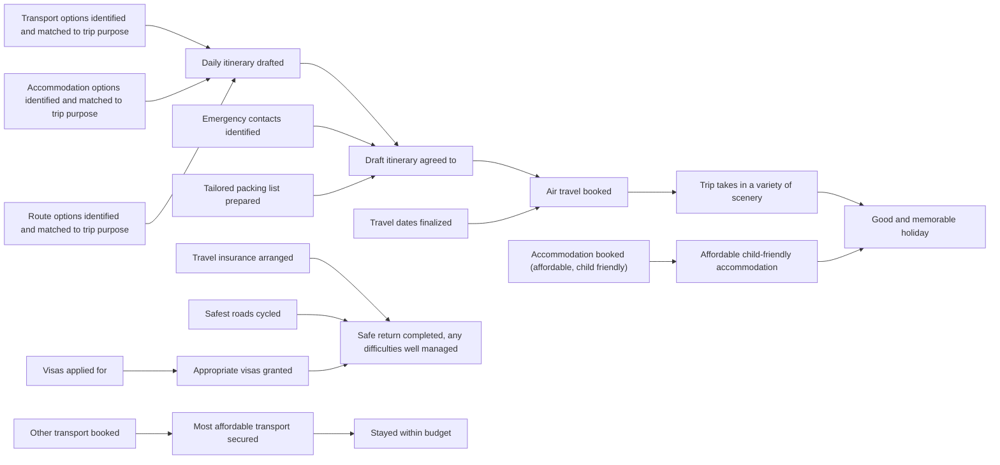

# DoView Tool J5 — DoView Communication Mapping

> **Pair:** [Question](j5question.md) · Tool (this page)

Most business and private communication focuses on what action to take next. DoView strategy/outcomes diagrams capture the 'This-Then' logic of desired outcomes and the steps needed to achieve them. DoView Communications Mapping could be implemented by building AI apps that create DoViews of what you want to achieve. Then all of your incoming messages, regardless of channel, could be split into summary snippets relevant to particular boxes within the DoView. You could review the messages and respond directly from each box. Eventually, your DoView diagrams could sync with others, so your replies land on similar boxes within their DoView. While new interfaces would be needed, AI can already build quality DoViews, and there are no technical barriers to AI splitting up and summarizing messages. So you would open your computer and, as below, see a DoView mapping of all relevant communications received overnight.

## Diagram

### Communications mapped onto DoView boxes (sample overnight messages)

| Box | Channel / sender | Message snippet |
|---|---|---|
| Daily itinerary drafted | (user prompt) | "You can either leave to come home at 7 am or in the late afternoon on the last day?" |
| Air travel booked | Sam (FlightDesk) | "Best fare dropped $85 - should I book it?" |
| Accommodation booked (affordable, child friendly) | Anna (Green Hostels) | "Family room with foldout bed for child, $200 - Confirm." |
| Travel insurance arranged | Ravi (Travel Cover) | "Policy activates on the day you leave the country and we have received your payment." |
| Visas applied for | Lisa (Visa Pro) | "You need to retake the photo please resend." |
| Safest roads cycled | Carlos (Cycle Tours) | "Updated map - section 4 shows that there is a dedicated cycle lane." |

---

*Source: Outcomes Theory & DoView Planning. DoViewPlanning.Org Copyright Dr Paul Duignan 2025. DOVIEW PLANNING AND PRACTICAL OUTCOMES THEORY HANDBOOK (2025).*
