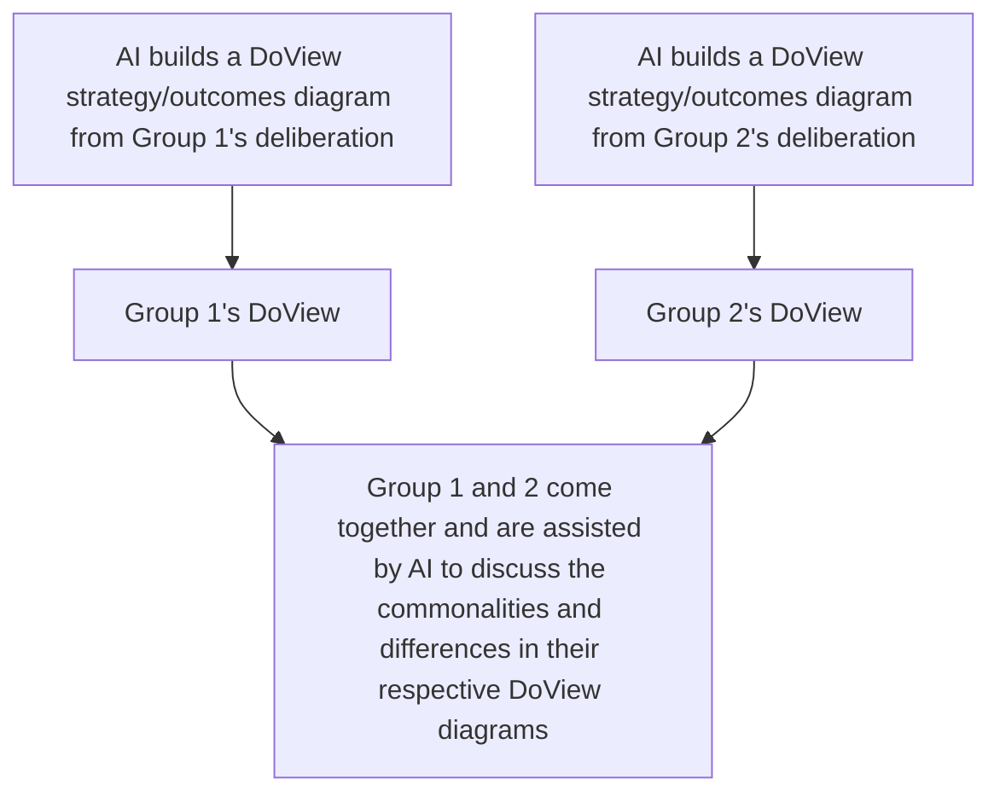

# DoView Tool J7 — Using AI DoViewing in Dialog Processes

> **Pair:** [Question](j7question.md) · Tool (this page)

The Rich Dialog Process is a dialog process where parties that are likely to have differing views on an issue participate in a deliberative process. They first discuss the issue in separate groups and then come together to jointly discuss the issue. The intention is not to get consensus but to simply expose the groups to alternative ideas. The Rich Dialog process may be able to be enhanced by getting AI to generate DoView strategy/outcomes diagrams relevant to what is being discussed. AI could then assist the different groups when they come together and examine similarities and differences in their ideas, as represented in their separate DoView diagrams. (See the AI Drawing Prompt at DoViewPlanning.Org). AI DoViewing may be able to be used in similar ways in other dialog processes.

## Diagram

---

*Source: DOVIEW PLANNING AND PRACTICAL OUTCOMES THEORY HANDBOOK (2025). DoView Planning.Org. Copyright Dr Paul W Duignan.*
