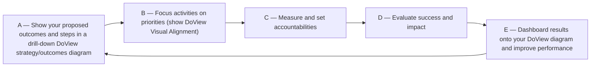

# PDF to Mermaid Markdown

Convert each PDF under `docs/pdf/` into a corresponding markdown file under `docs/md/`. Where a PDF contains a diagram, framework, or visual model, render it as a Mermaid diagram inside the markdown. Pair files (e.g. `a1question.pdf` + `a1tool.pdf`) get cross-linked.

## Why this matters

The PDFs in scope (e.g. the DoView Planning handbook) carry meaning in two layers: prose explanation *and* a visual model. A naive text extraction loses the model. Mermaid lets the markdown carry the visual structure as code — version-controllable, searchable, and editable. Cross-linking pairs lets a reader bounce between the explanation ("question") and the diagram ("tool") without leaving the document.

## Inputs and outputs

- **Input**: a directory of PDFs. Default `docs/pdf/`. The user may specify a different directory or a subset of files.
- **Output**: one `.md` file per `.pdf` in `docs/md/`, preserving the base name (e.g. `a1question.pdf` → `docs/md/a1question.md`).
- **Idempotency**: if the target `.md` already exists, skip it. Tell the user how many were skipped at the end.

## Workflow

### 1. Discover and pair

List the input directory. Group files by their base prefix:

- `a1question.pdf` and `a1tool.pdf` → pair `a1`.
- A file without a partner (e.g. `conclusion.pdf`) → standalone.

The prefix is everything before `question` or `tool` at the end of the filename. Some prefixes have an extra letter (e.g. `g2a` is a separate pair from `g2`); preserve them exactly.

Build a list of `(pdf_path, output_md_path, partner_md_path_or_null)` tuples. Filter out any entries where the output MD already exists.

### 2. Convert each PDF

For each remaining PDF:

1. **Read the PDF** with the `Read` tool. Claude reads PDFs natively — both the extracted text and the rendered page image are returned, so you can see diagrams as well as prose.
2. **Identify the structure**:
   - Title line (often a question for `*question.pdf` or `DoView Tool [code] - [title]` for `*tool.pdf`).
   - Body prose paragraphs.
   - Diagram regions (boxes, arrows, flow, matrices, side annotations like NOW/FUTURE).
   - Source/footer line — preserve it but de-emphasise it (italics at bottom).
3. **Write the markdown** following the template below.

### 3. Markdown template

Use this structure for every output file:

```markdown
---
source_pdf: <relative path, e.g. docs/pdf/a1question.pdf>
pair: <prefix, e.g. a1>           # omit for standalone files
kind: question | tool | standalone
---

# <Title from the PDF>

> **Pair:** [Question](a1question.md) · [Tool](a1tool.md)   <!-- omit for standalone -->

<body prose, in clean paragraphs>

## Diagram                                                  <!-- only if a diagram exists -->

```mermaid
<mermaid code>
```

<any prose annotations that belong with the diagram, e.g. "NOW / FUTURE" labels, legend explanations>

---

*Source: <footer text from the PDF>*
```

Notes on the template:

- The `Pair` line at the top should appear in **both** files of a pair, with the link to the *other* file given prominence. Put the current file in plain text (no link) so the reader can see which side they're on. Example for `a1question.md`: `> **Pair:** Question (this page) · [Tool](a1tool.md)`.
- Use `kind: standalone` and omit the pair line for files with no partner (e.g. `conclusion.pdf`).
- Don't invent headings the PDF doesn't have. If the PDF has only prose, omit the `## Diagram` section entirely.

### 4. Diagrams → Mermaid

When the PDF page contains a visual model, convert it to Mermaid. Pick the variant that best fits the model — the goal is to preserve the *meaning* of the diagram, not pixel-match the layout.

See `references/mermaid_patterns.md` for worked examples of the common DoView diagram patterns: cyclic step flows, function-vs-step matrices, evolution timelines with side annotations, and drill-down outcome trees.

Quick guidance:

- **Cyclic flows** (A → B → C → D → E → A): `flowchart LR` with arrows. Label each node with its letter and short description.
- **Drill-down / hierarchy**: `flowchart TD` or `graph TD`.
- **Comparison matrices** (rows of functions × letter chips for steps used): a markdown table is usually clearer than a Mermaid diagram. Use a table unless the matrix has visual structure (e.g. arrows linking cells) that a table can't carry.
- **Evolution / before-after with side text**: `flowchart TD` with two subgraphs ("NOW", "FUTURE") and a connecting arrow, plus prose annotations after the diagram.
- **Stacked boxes with single arrow**: `flowchart TD` with linear `-->` between nodes.

If a diagram genuinely cannot be expressed as Mermaid (e.g. a photograph, freehand sketch, or an icon-heavy infographic), describe it in prose under `## Diagram` and note `_This page contains a visual that does not translate cleanly to Mermaid; described above._`. Do not invent structure that isn't there.

### 5. Quality bar for the prose

- Preserve paragraph breaks from the PDF.
- Fix obvious OCR-like artifacts (split words across lines, stray hyphens) but don't paraphrase. The user wants the source text faithfully.
- Don't add commentary, summaries, or "this document explains…" framing. Just the content.
- Don't bold or italicise inside paragraphs unless the original visibly uses emphasis.

### 6. Skip-if-exists logic

Before each PDF: check if the target `.md` already exists. If it does, skip silently and increment a counter. After the run, report e.g. `Converted 4 PDFs. Skipped 215 (already exist).`

To force re-conversion the user must delete the existing `.md` file(s) — this is intentional, not a flag.

### 7. Reporting

When the run completes, output a brief summary:

```
Converted: <N>
Skipped (already exist): <M>
Failed: <K>     # only if any failed; list the filenames
Output dir: docs/md/
```

## Defaults and overrides

- Default input dir: `docs/pdf/`
- Default output dir: `docs/md/`
- Both can be overridden if the user specifies different paths.
- If `docs/md/` doesn't exist, create it.

## Edge cases

- **Single-file PDFs with no partner** (e.g. `conclusion.pdf`): treat as standalone, omit pair line, set `kind: standalone`.
- **Multi-page PDFs**: read all pages. The `Read` tool supports a `pages` argument for large PDFs (>10 pages); the doview-book PDFs are typically 1 page each so this rarely matters.
- **PDFs with only diagram, no prose** (some `*tool.pdf` files): output the title, then the `## Diagram` section, then the source footer. No body prose section.
- **PDFs with only prose, no diagram** (some `*question.pdf` files): output the title and body prose. Omit the `## Diagram` section entirely.

## A worked example

Input pair: `docs/pdf/a1question.pdf` and `docs/pdf/a1tool.pdf`.

`docs/pdf/a1question.pdf` — text-only page asking "How can DoView strategy/outcomes diagrams be used for…" with several paragraphs of prose.

`docs/pdf/a1tool.pdf` — a 5-step cyclic flow (A→B→C→D→E→A) plus a comparison matrix showing which steps apply to which organizational functions.

Resulting `docs/md/a1question.md`:

```markdown
---
source_pdf: docs/pdf/a1question.pdf
pair: a1
kind: question
---

# How can DoView strategy/outcomes diagrams be used for any government, corporate, nonprofit or community organizational or initiative planning?

> **Pair:** Question (this page) · [Tool](a1tool.md)

The DoView Planning approach is a simple planning process based on using DoView strategy/outcomes diagrams. Use it at any level within any organization, agency, provider, policy or initiative. It has five generic steps: A) show your proposed outcomes and steps in a DoView drill-down strategy/outcomes diagram; B) focus your activity on your priorities (show DoView Visual Alignment); C) measure and set accountabilities; D) evaluate success and impact; and, E) dashboard results onto the DoView strategy/outcomes diagram to report on and improve performance.

…

---

*Source: DoView Planning and Practical Outcomes Theory Handbook (2025). DoView Planning.Org. Copyright Dr Paul W Duignan.*
```

Resulting `docs/md/a1tool.md`:

```markdown
---
source_pdf: docs/pdf/a1tool.pdf
pair: a1
kind: tool
---

# DoView Tool A1 — The Five Steps in DoView Planning

> **Pair:** [Question](a1question.md) · Tool (this page)

The normal planning, alignment, monitoring, evaluation, and reporting steps for any organization or initiative are shown below…

## Diagram



### Where the steps are used

| Function | Steps |
|---|---|
| Strategic planning & priority setting | A, B |
| Organizational alignment / enterprise portfolio management | A, B |
| Program monitoring / performance management | A, C, E |
| Program evaluation | A, D, E |
| Evidence-based practice | A |
| Outcomes-focused contracting / delegation | A, B, C, E |

---

*Source: DoView Planning and Practical Outcomes Theory Handbook (2025). DoView Planning.Org. Copyright Dr Paul W Duignan.*
```

## Reference files

- `references/mermaid_patterns.md` — DoView diagram archetypes with worked Mermaid examples.
