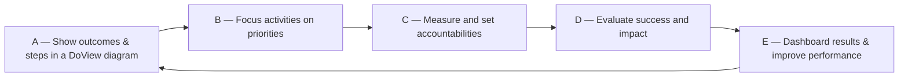
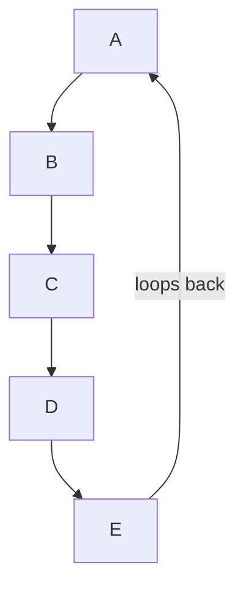
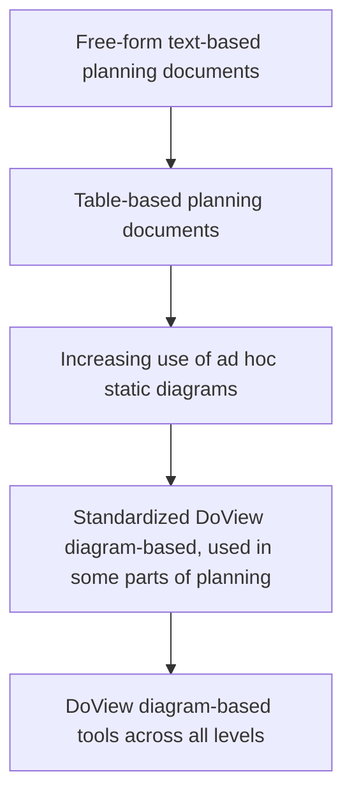
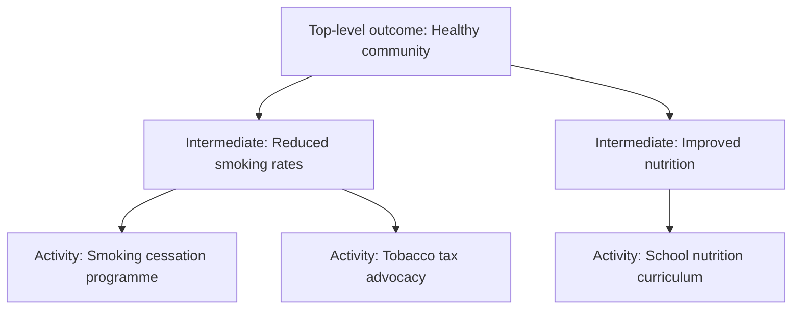
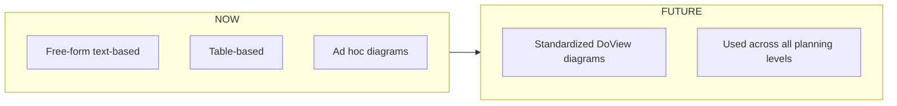
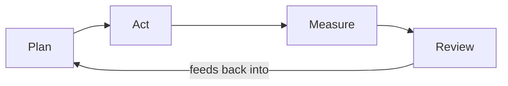
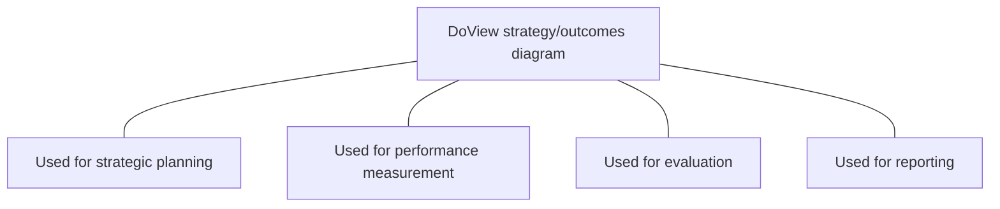

# DoView diagram patterns → Mermaid

Worked examples of the diagram archetypes that show up in DoView (and similar planning) PDFs. Match the source PDF's diagram to the closest pattern below and adapt.

## 1. Cyclic step flow (A → B → C → D → E → A)

Source: a numbered/lettered ring of steps where each step feeds the next and the last loops back.

If the cycle is more visually circular than linear, `flowchart TB` with the loop arrow drawn explicitly works:

## 2. Linear pipeline / progression

Source: a top-to-bottom or left-to-right arrow with stacked boxes representing stages over time.

If the source labels the endpoints (e.g. NOW / FUTURE), put those as prose under the diagram rather than forcing them into Mermaid:

> **NOW** is roughly the middle of the chain (boxes 3–4). **FUTURE** is the bottom box.

This keeps the diagram clean and the temporal labels readable.

## 3. Comparison matrix (rows × steps)

Source: a table with row labels (functions, scenarios) and chips/letters in columns indicating which apply.

A markdown table is almost always clearer than a Mermaid diagram here:

| Function | Steps |
|---|---|
| Strategic planning & priority setting | A, B |
| Program evaluation | A, D, E |
| Evidence-based practice | A |

Use Mermaid only if the matrix has *visual* structure (arrows linking cells, grouped subgraphs) that a table cannot carry.

## 4. Drill-down / outcomes tree

Source: a hierarchy of outcomes, with a top-level outcome decomposing into intermediate and then activity-level steps.

For deep trees, keep node labels short and put the longer descriptions in prose afterwards.

## 5. Two-column comparison (e.g. NOW vs FUTURE)

Source: side-by-side columns, often with an arrow connecting them.

## 6. Process with feedback loop

Source: a forward chain of steps with an arrow looping back from a later step to an earlier one.

## 7. Single concept with annotations

Source: a single central box surrounded by labels or notes.

Often these are clearer as prose plus a small diagram:

## When NOT to use Mermaid

- The visual is decorative (a logo, an icon, a stock photograph).
- The visual relies on spatial layout that Mermaid can't reproduce (e.g. a hand-drawn sketch where position carries meaning beyond connections).
- The "diagram" is really a list with bullet points styled as boxes — just use a markdown list.

In these cases, describe the visual in one sentence under `## Diagram` and add `_This page contains a visual that does not translate cleanly to Mermaid; described above._`

## Tips

- Keep node labels short. If the PDF box has 3 lines of text, put the first line in the node label and the rest in prose under the diagram.
- Quote node labels with `"..."` whenever they contain spaces, punctuation, or parentheses.
- Use `flowchart` (not the older `graph`) — it has better layout and label support.
- Don't try to match the PDF's exact visual style. A clean Mermaid diagram that captures the *connections* is more valuable than a baroque one that tries to mimic colours and shapes.
